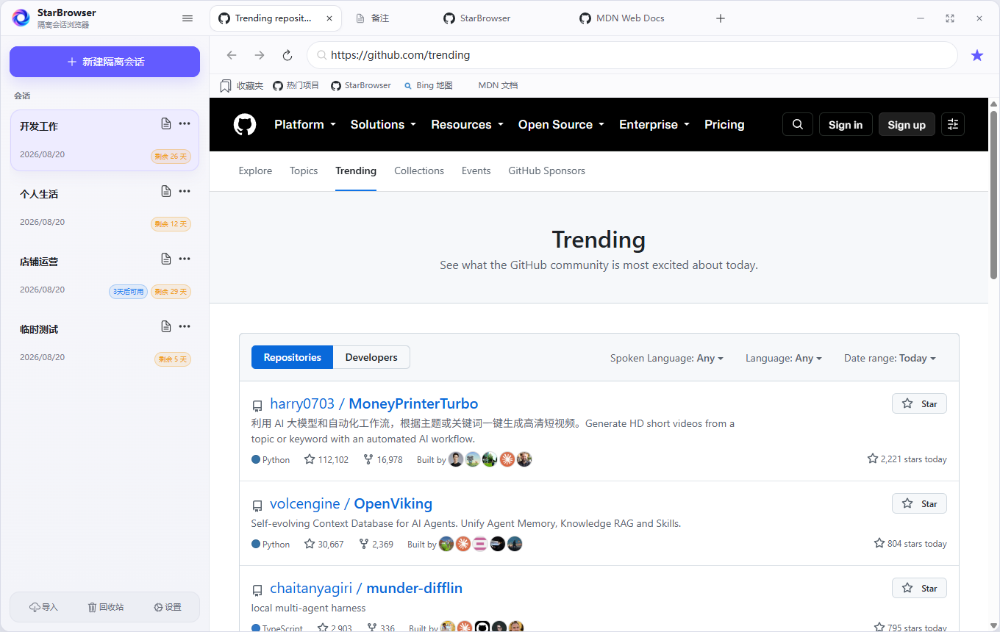
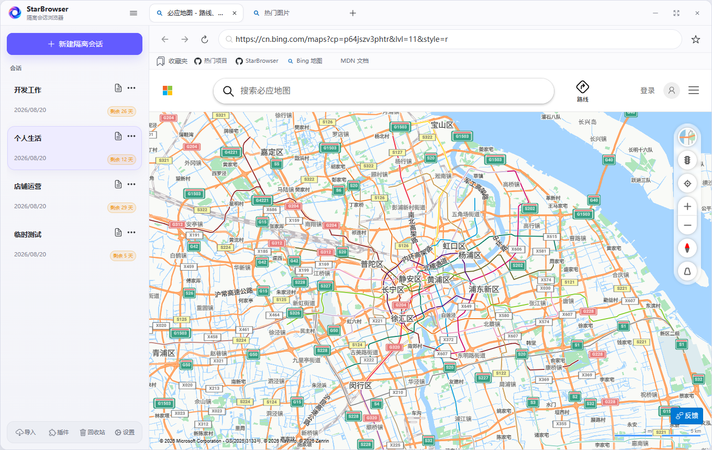
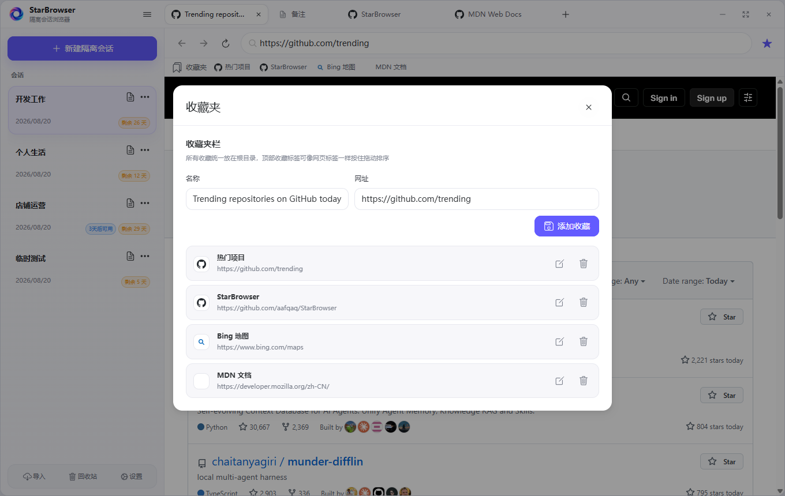
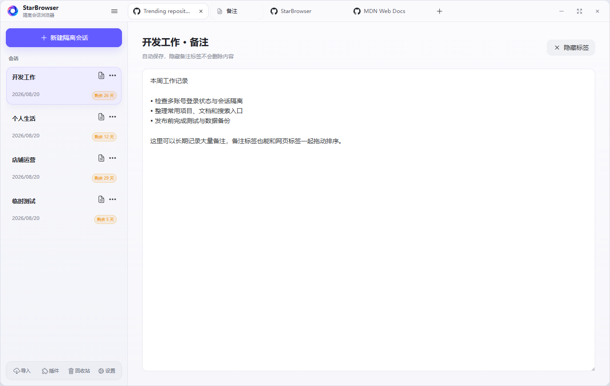
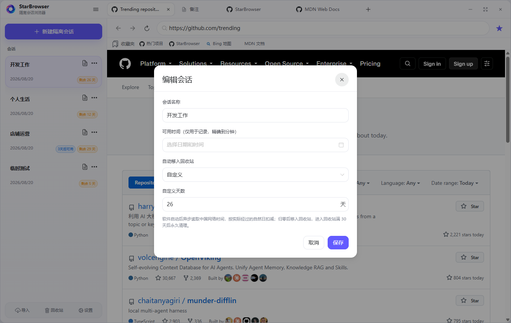

<p align="center">
  
</p>

<p align="center">
  <a href="https://github.com/aafqaq/StarBrowser/releases/latest"></a>
  <a href="https://github.com/aafqaq/StarBrowser/releases/latest"></a>
  <a href="https://github.com/aafqaq/StarBrowser/actions/workflows/build.yml"></a>
  <a href="https://github.com/aafqaq/StarBrowser/stargazers"></a>
  <a href="LICENSE"></a>
</p>

<p align="center">
  <b>StarBrowser 是一款面向 Windows 的会话隔离浏览器，也是一款便携式多账号浏览器。</b><br />
  每个会话独立保存 Cookie、Local Storage、IndexedDB、缓存与登录状态；同一会话内的标签页正常共享网站数据。
</p>

<p align="center">
  <a href="https://github.com/aafqaq/StarBrowser/releases/latest"><b>下载最新版</b></a>
  · <a href="#快速开始">快速开始</a>
  · <a href="#数据与隐私">数据与隐私</a>
  · <a href="https://github.com/aafqaq/StarBrowser/issues">问题反馈</a>
</p>

<p align="center">
  
</p>

## 为什么使用 StarBrowser

需要同时登录多个网站账号时，普通浏览器往往要反复退出账号、切换用户目录或打开隐私窗口。StarBrowser 把一个独立浏览器身份做成一张会话卡片：工作账号、个人账号、店铺账号、社交媒体账号和测试环境可以在一个窗口中快速切换，登录状态互不串号。

| 会话之间 | 会话内部 |
|---|---|
| Cookie、站点存储、缓存与登录凭证相互隔离 | 多个标签页共享同一套站点数据，登录一次即可正常使用 |
| 每个会话保留自己的标签页与备注 | 标签支持新建、切换、关闭和实时拖动排序 |
| 可单独重建、回收、加密导入或导出 | 收藏夹由所有会话共享 |

## 核心功能

- **会话隔离**：每个会话使用独立、持久化的 Chromium 存储分区。
- **多账号同时登录**：适合店铺运营、社交媒体矩阵、开发测试和临时账号管理。
- **完整多标签浏览**：网站图标、加载状态、标签顺序和打开页面均会保存。
- **便携免安装**：程序、Chromium 内核和用户数据位于同一个文件夹。
- **备注与收藏**：会话专属的大容量备注标签，以及全局共享收藏夹。
- **数据迁移**：可加密导入、导出单个会话，不包含网页缓存和收藏夹。
- **性能调节**：五档性能模式调整后台帧率、节流和视觉效果；已打开页面不会被自动销毁。
- **受限插件系统**：插件使用声明式 JSON，由应用统一管理权限、配置、更新和网络访问。

## 界面预览

<p align="center">
  
</p>

<table>
  <tr>
    <td width="50%"></td>
    <td width="50%"></td>
  </tr>
  <tr>
    <td align="center"><b>切换会话，切换完整浏览器身份</b></td>
    <td align="center"><b>所有会话共享收藏</b></td>
  </tr>
  <tr>
    <td width="50%"></td>
    <td width="50%"></td>
  </tr>
  <tr>
    <td align="center"><b>在独立标签中记录大量备注</b></td>
    <td align="center"><b>管理会话信息与生命周期</b></td>
  </tr>
</table>

## 快速开始

1. 从 [Releases](https://github.com/aafqaq/StarBrowser/releases/latest) 下载 `StarBrowser-Windows-x64-v*.zip`。
2. 将 ZIP **完整解压**到普通文件夹，不要只取出 EXE。
3. 双击 `StarBrowser.exe`，新建会话并登录网站。

支持 Windows 10 / 11 x64，无需安装，也不依赖电脑预装的浏览器内核。

> [!IMPORTANT]
> 请勿直接在压缩包内运行。移动软件时应先完全退出，再复制整个 StarBrowser 文件夹。

## 数据与隐私

所有本地数据都保存在程序同级的 `data` 目录：

```text
StarBrowser/
├─ StarBrowser.exe
├─ resources/          程序运行文件
├─ locales/            Chromium 语言文件
└─ data/
   ├─ state.json       会话、标签、备注、收藏和设置
   ├─ state.backup.json
   ├─ plugins/         插件配置与缓存
   └─ electron/        Cookie、Local Storage、IndexedDB、缓存等
```

- 备份时：完全退出软件，然后复制整个 `data` 文件夹。
- 迁移时：复制完整的 StarBrowser 文件夹，或使用会话导入导出。
- StarBrowser 不提供云同步，不会将会话、Cookie、备注、收藏或浏览记录上传到项目服务器。
- `data` 可能包含有效登录凭证，请勿上传到公开仓库或交给他人。

## 更新与兼容

StarBrowser 启动后会异步检查 GitHub Releases，也可在 **设置 → 检查更新** 中手动检查。更新包下载并通过 SHA-256 校验后，应用只替换程序清单内的文件，明确排除 `data`；更新失败时保留当前版本和数据。

状态结构、浏览器存储、会话包格式和加密算法都具有独立版本号，为后续数据迁移保留兼容空间。

## 使用许可

StarBrowser 的原创代码、界面、文档和原创资源采用 [PolyForm Noncommercial 1.0.0](LICENSE)：

- 个人学习、研究、娱乐及其他非商业用途可免费使用、修改和分发。
- 商业产品、收费服务、转售、变现分发或企业商业运营须事先取得作者书面授权。
- Electron、Chromium、Vue、Naive UI 等第三方组件仍遵循各自许可证，详见 [第三方许可声明](THIRD_PARTY_NOTICES.md)。

商业授权请通过 [@aafqaq](https://github.com/aafqaq) 或 [Issues](https://github.com/aafqaq/StarBrowser/issues) 联系。

## 常见问题

<details>
<summary><b>不同会话真的不会串登录状态吗？</b></summary>

每个会话使用不同的持久化 Chromium partition，因此 Cookie、本地存储、IndexedDB 和缓存目录彼此隔离；同一会话的标签页则共享一个 partition。
</details>

<details>
<summary><b>为什么 Windows 提示“未知发布者”？</b></summary>

项目暂未使用商业代码签名证书，Windows SmartScreen 可能显示提醒。请只从本仓库 Releases 下载，并核对发布清单中的 SHA-256。
</details>

<details>
<summary><b>支持 macOS 或 Linux 吗？</b></summary>

目前只维护 Windows 10 / 11 x64。
</details>

---

<p align="center">
  如果 StarBrowser 对你有帮助，欢迎点一个 <a href="https://github.com/aafqaq/StarBrowser/stargazers"><b>Star</b></a>，让更多需要会话隔离浏览器的人找到它。
</p>
