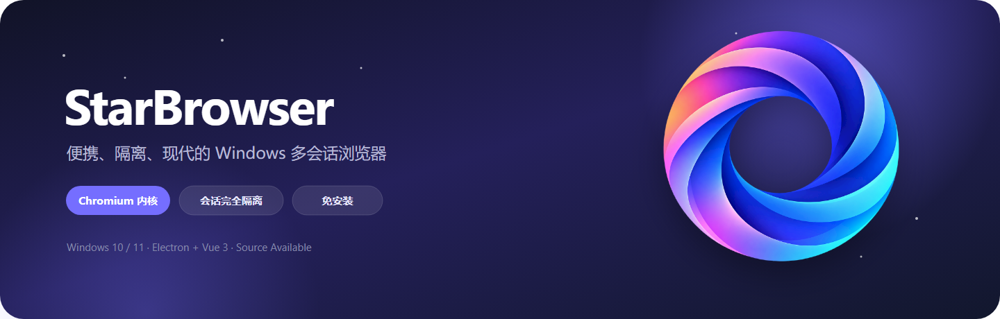
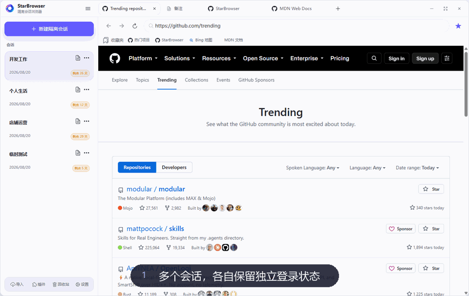
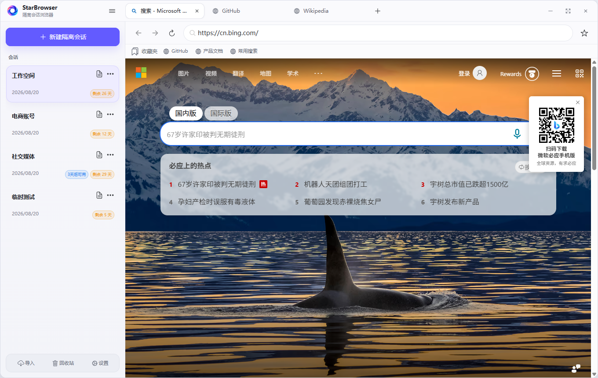
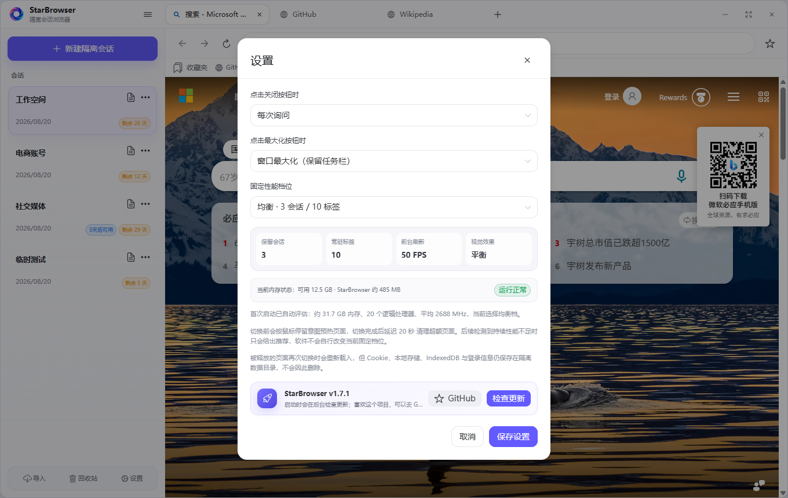
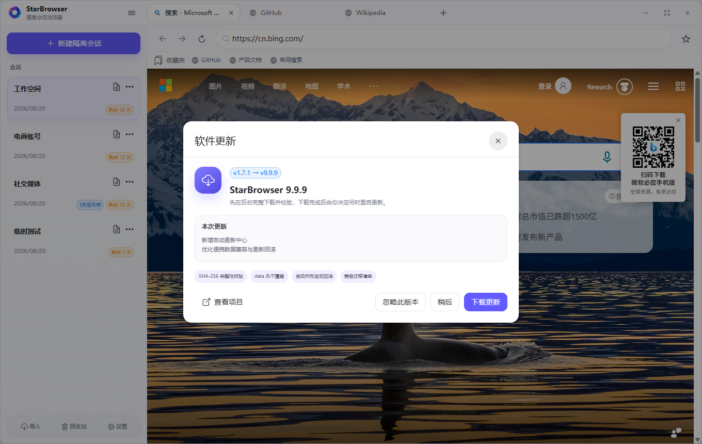

<p align="center">
  
</p>

<p align="center">
  <a href="https://github.com/aafqaq/StarBrowser/releases/latest"></a>
  <a href="https://github.com/aafqaq/StarBrowser/releases/latest"></a>
  <a href="https://github.com/aafqaq/StarBrowser/actions/workflows/build.yml"></a>
  <a href="https://github.com/aafqaq/StarBrowser/stargazers"></a>
  <a href="LICENSE"></a>
</p>

<p align="center">
  <b>一个文件夹，多个互不干扰的浏览器身份。</b><br />
  Chromium 内核 · Windows 10/11 · 免安装 · 会话隔离 · 数据随身携带
</p>

<p align="center">
  <a href="https://github.com/aafqaq/StarBrowser/releases/latest"><b>⬇️ 下载最新版</b></a>
  &nbsp;&nbsp;·&nbsp;&nbsp;
  <a href="#三步开始使用">🚀 快速开始</a>
  &nbsp;&nbsp;·&nbsp;&nbsp;
  <a href="#数据放在哪里">🛡️ 数据安全</a>
  &nbsp;&nbsp;·&nbsp;&nbsp;
  <a href="#使用许可">📜 使用许可</a>
  &nbsp;&nbsp;·&nbsp;&nbsp;
  <a href="https://github.com/aafqaq/StarBrowser/issues">💬 问题反馈</a>
</p>

---

## ✨ 一眼看看 StarBrowser

<p align="center">
  
</p>

> 截图和动图均由独立的全新临时数据目录自动生成，不包含开发者或用户的真实会话、账号、收藏和浏览记录。

<table>
  <tr>
    <td width="50%"></td>
    <td width="50%"></td>
  </tr>
  <tr>
    <td align="center"><b>双栏浏览与隔离会话</b></td>
    <td align="center"><b>五档性能与用户偏好</b></td>
  </tr>
</table>

<p align="center"></p>

## 🌟 它能做什么

| | 功能 | 使用体验 |
|---|---|---|
| 🧩 | **真正的会话隔离** | 每个会话拥有独立 Cookie、Local Storage、IndexedDB、缓存和登录状态；同一会话的多个标签页自然共享登录。 |
| 🧭 | **完整 Chromium 内核** | 浏览器核心随软件一起提供，不依赖电脑是否安装 Chrome 或 WebView2。 |
| 🗂️ | **现代标签页** | 新建、切换、关闭和拖动排序；网站图标与加载状态一目了然，标签顺序自动保存。 |
| 📝 | **大容量备注标签** | 备注像网页一样放在顶部标签栏，可拖动排序；隐藏标签不会删除已保存内容。 |
| ⭐ | **全局收藏栏** | 所有会话共享，支持自动获取网站图标、顶栏快速打开、编辑与拖动排序。 |
| ♻️ | **自动回收与恢复** | 可选永不回收、1/7/15/30 天或自定义天数；到期进入回收站，30 天后自动清理。 |
| ⏰ | **可用时间记录** | 在会话卡片显示“几天后 / 几小时后 / 几分钟后可用”，只记录信息，不限制浏览。 |
| 📦 | **加密导入导出** | `.sbsession` 会话包保存标签、Cookie 和登录相关存储，不包含缓存、快照与收藏夹。 |
| ⚡ | **五档性能策略** | 首次启动按电脑配置选择固定档位；超低配尽量节省内存，高配保留更多会话与标签。 |
| 🔄 | **安全自动更新** | 启动后异步检查，也可在设置中手动检查；先下载校验，再由你选择何时重启更新。 |
| 🖱️ | **Windows 原生体验** | 自定义圆角标题栏，同时保留拖到屏幕顶部最大化、双击标题栏和任务栏安全边界。 |
| 📋 | **系统剪贴板与右键菜单** | 网页、地址栏和备注可使用系统复制粘贴，网页区域提供中文右键菜单。 |

## 🚀 三步开始使用

1. 前往 [Releases](https://github.com/aafqaq/StarBrowser/releases/latest) 下载 `StarBrowser-Windows-x64-v*.zip`。
2. 把 ZIP **完整解压到一个普通文件夹**，不要只单独拖出 EXE。
3. 双击 `StarBrowser.exe`，新建会话后即可登录不同账号。

软件无需安装。Chromium 运行文件、主程序和用户数据都会位于同一个文件夹中，适合放在桌面、移动硬盘或其他自选位置。

> [!IMPORTANT]
> 请勿直接在 ZIP 压缩包内运行，也不要把 `StarBrowser.exe` 单独移动到别处；它需要同级的 `resources`、`locales` 等运行文件。

## 📜 使用许可

StarBrowser 的原创代码、界面、文档和原创项目资源采用 [PolyForm Noncommercial 1.0.0](LICENSE) 源码公开许可：

- ✅ 个人学习、研究、娱乐及其他非商业用途可以免费使用。
- ✅ 非商业修改和再分发可以进行，但必须保留许可文本和作者声明。
- 🔐 用于商业产品、收费服务、转售、变现分发或企业商业运营前，必须先取得作者书面授权。
- 📮 商业授权可通过 GitHub 账号 [@aafqaq](https://github.com/aafqaq) 或本仓库 Issues 联系。

Electron、Chromium、Vue、Naive UI 等第三方组件不适用上述商业限制，仍各自遵循原许可证；详见 [第三方许可声明](THIRD_PARTY_NOTICES.md)。这是非商业源码公开许可，不属于 OSI 定义的开源许可证。

## 🛡️ 数据放在哪里

首次运行后，程序同级会出现：

```text
StarBrowser/
├─ StarBrowser.exe
├─ resources/          软件运行文件
├─ locales/            Chromium 语言文件
└─ data/               你的全部本地数据
   ├─ state.json       会话、标签、备注、收藏和设置
   ├─ state.backup.json
   └─ electron/        Cookie、Local Storage、IndexedDB、缓存等
```

- ✅ 移动软件：先完全退出，然后复制**整个文件夹**。
- ✅ 备份数据：退出软件后备份整个 `data` 文件夹。
- ✅ 清空一切：退出软件后移走或删除 `data`；此操作不可恢复。
- ❌ 不要在软件运行时用同步盘同时修改 `data`。
- ❌ 不要把包含真实登录状态的 `data` 上传到网盘或公开仓库。

StarBrowser 不提供云同步，也不会把会话、Cookie、备注、收藏或浏览记录上传到项目服务器。网页本身的数据处理仍受对应网站的隐私规则约束。

## 🔄 自动更新如何保护数据

每次启动后，StarBrowser 会延迟几秒异步访问本项目的 GitHub Releases。没有新版本时不会打扰使用；也可以在 **设置 → 检查更新** 中手动检查，并从设置直接打开 GitHub 给项目点 Star。

发现新版后：

1. 显示更新说明，可选择稍后处理或忽略这个版本。
2. 在后台下载 ZIP，并实时显示百分比、已下载大小和速度。
3. 完成 SHA-256 校验与受限解压后，才出现“重启并更新”。
4. 重启时只替换程序清单内的软件文件，永远排除 `data` 和无法识别的用户文件。
5. 新版启动通过健康检查后，自动删除下载包、解压目录和回滚副本。
6. 如果替换失败或新版无法正常启动，自动恢复旧程序与更新前配置。

兼容清单分别记录应用状态结构、Chromium 存储结构、会话包格式和加密算法版本。未来即使这些规则升级，也可以在新版本启动阶段执行迁移，而不是简单拒绝更新或覆盖旧配置。

## 📦 会话导入导出

会话菜单支持导出当前隔离会话，导入后会创建一个新会话：

- 包含：会话名称、备注、标签页、Cookie、Local/Session Storage、IndexedDB 等登录凭证类数据。
- 不包含：收藏夹、HTTP 缓存、网页快照和无关临时文件。
- 当前格式：会话包格式 `v1`，加密算法 `v1`，使用 scrypt + AES-256-GCM。
- 密码无法找回；请使用足够强的密码，并通过安全渠道传递会话包。

## ⚡ 性能档位怎么选

| 档位 | 适合设备 | 页面保留倾向 |
|---|---|---|
| 超低配 | 4 GB 左右内存、较老 CPU | 最积极释放后台页面，优先保证当前页面流畅 |
| 低配 | 8 GB 左右内存 | 少量常用会话与标签常驻 |
| 均衡 | 普通办公电脑 | 在内存占用和切换速度之间平衡 |
| 高配 | 16–32 GB 内存 | 保留更多会话与标签，切换更快 |
| 超高配 | 32 GB 以上或高性能工作站 | 最大化常驻数量和视觉体验 |

首次启动会按硬件自动选择一个档位并固定保存。软件发现持续内存压力时只会提示推荐档位，不会擅自更改你的选择。

## ❓ 常见问题

<details>
<summary><b>不同会话真的不会串登录吗？</b></summary>

每个会话使用不同的持久化 Chromium partition。不同会话的 Cookie、本地存储和缓存目录互相隔离；同一会话中的所有标签页共享同一个 partition。
</details>

<details>
<summary><b>后台页面为什么偶尔会重新加载？</b></summary>

当实际保留数量超过当前性能档位预算时，StarBrowser 会释放较久未使用的网页进程。标签、网址、Cookie 和站点存储不会被删除，重新切换时页面会恢复加载。可在设置中提高性能档位。
</details>

<details>
<summary><b>Windows 提示“未知发布者”怎么办？</b></summary>

源码公开项目暂未提供商业代码签名证书时，Windows SmartScreen 可能显示提醒。请只从本仓库 Releases 下载，并核对 Release 提供的 SHA-256 更新清单。不要使用来源不明的二次打包版本。
</details>

<details>
<summary><b>软件支持 macOS 或 Linux 吗？</b></summary>

目前只维护 Windows 10/11 x64，其他平台不在支持范围内。
</details>

## 💜 喜欢的话

如果 StarBrowser 让多账号管理轻松了一点，欢迎：

- ⭐ 点击右上角 **Star**，让更多人看到项目
- 🐛 在 [Issues](https://github.com/aafqaq/StarBrowser/issues) 报告可复现的问题
- 💡 分享你希望加入的使用场景
- 🔗 把项目推荐给同样需要多会话隔离的朋友

<p align="center">
  <a href="https://github.com/aafqaq/StarBrowser/stargazers"></a>
</p>

---

<p align="center">
  <sub>基于 Electron、Chromium、Vue 3 与 Naive UI · PolyForm Noncommercial 1.0.0</sub>
</p>
